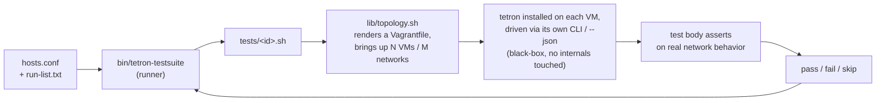

# tetron-testsuite

An automated VM testing suite for [tetron](https://github.com/ErikAllanKincaid/tetron), a P2P mesh VPN. It provisions disposable VM topologies, installs a tetron build on each, drives tetron entirely through its own CLI/`--json` output -- a black-box approach, exercising tetron the same way a person testing it by hand would, not by reaching into its internals -- and asserts on real network behavior.

**Optional and separate from tetron on purpose**, same relationship tetron-webui and tetron-systray have to core: a genuinely separate, opt-in addon. Nothing about tetron's own behavior changes whether this exists or not. This addon tests whatever tetron binary you point it at; it does not carry a wire-compatibility relationship with one specific core version, so it versions independently rather than mirroring tetron's own minor version.

## How it works



## Prerequisites (not automated -- set these up yourself first)

This suite deliberately does no preflight/auto-install/auto-detect logic of its own -- if any of the below is missing on a declared host, tests against that host will fail with whatever error `vagrant`/`ssh` produces, and this suite will not diagnose or fix environment setup for you. Run the following once on **every host** you intend to list in `hosts.conf` (both `local` and any `ssh:` target), before running any test.

### 1. Confirm hardware virtualization is available

```bash
grep -E '(vmx|svm)' /proc/cpuinfo >/dev/null && echo "virtualization extensions present" || echo "NOT PRESENT -- stop here, this host cannot run KVM guests"
ls /dev/kvm 2>/dev/null && echo "/dev/kvm exists" || echo "/dev/kvm missing -- install qemu-kvm below, then re-check"
```

If `/dev/kvm` is still missing after installing `qemu-kvm` (next step), that host will fall back to slow software emulation for its VMs -- workable for these tests (they are not compute-heavy), but noticeably slower to boot.

### 2. Install libvirt/KVM (Debian/Ubuntu -- adjust package manager for other distros)

```bash
sudo apt update
sudo apt install -y qemu-kvm libvirt-daemon-system libvirt-clients bridge-utils virtinst

sudo usermod -aG libvirt,kvm "$USER"
# Log out and back in (or `newgrp libvirt`) for the group change to take effect
# before continuing -- the next steps assume it already has.
```

### 3. Install Vagrant

Distro package repos often lag behind; use HashiCorp's own apt repo instead:

```bash
wget -O- https://apt.releases.hashicorp.com/gpg | sudo gpg --dearmor -o /usr/share/keyrings/hashicorp-archive-keyring.gpg
echo "deb [signed-by=/usr/share/keyrings/hashicorp-archive-keyring.gpg] https://apt.releases.hashicorp.com $(lsb_release -cs) main" | sudo tee /etc/apt/sources.list.d/hashicorp.list
sudo apt update && sudo apt install -y vagrant
```

### 4. Install the vagrant-libvirt plugin

```bash
vagrant plugin install vagrant-libvirt
```

### 5. Install the other controller-side tools this suite's own scripts call directly

```bash
sudo apt install -y jq openssh-client
```

`jq` is only needed on the **controller** (the machine you run `./bin/tetron-testsuite` from), not on every declared host -- `lib/common.sh`'s `json_get` pipes a VM's `tetron status --json` output back to the controller and parses it there.

### 6. Sanity check everything above actually worked

```bash
virsh list --all      # should run with no error -- proves the libvirt daemon + your group membership are correct
vagrant plugin list    # should list vagrant-libvirt
vagrant box list       # first real run will download bento/ubuntu-24.04 automatically; fine if empty now
```

### 7. For any host reached over SSH (a `hosts.conf` entry that is not `local`)

Trust must already work non-interactively -- this suite never prompts for a password or passphrase.

```bash
ssh-copy-id user@remote-host          # if you don't already have a trusted key there
ssh -o BatchMode=yes user@remote-host true && echo "passwordless ssh works"
```

If you use an agent-forwarded or `IdentityFile`-pinned key via `~/.ssh/config` instead of a bare `user@host`, that Host alias is exactly what should go in `hosts.conf` as the SSH target (see `hosts.conf.example`) -- `run_on` shells out to plain `ssh`, so anything `ssh` itself resolves works here too.

### Summary checklist

- [ ] `/proc/cpuinfo` shows `vmx`/`svm`, and `/dev/kvm` exists
- [ ] `qemu-kvm` + `libvirt-daemon-system` installed, your user in `libvirt`/`kvm` groups (re-logged-in)
- [ ] `vagrant` installed, `vagrant-libvirt` plugin installed
- [ ] `jq` installed on the controller
- [ ] `virsh list --all` and `vagrant plugin list` both run clean
- [ ] Any SSH-reached host accepts a passwordless `ssh -o BatchMode=yes <target> true`

## Design

- **Bash + Python.** This addon does not link `tetron-proto`; it drives tetron black-box, so there is no need for the Cargo toolchain tetron-webui/tetron-systray require.
- **Host inventory is fully generic.** `hosts.conf` lists hosts as `local` or an SSH target. The code never distinguishes "same LAN" from "different network reached over the open internet" -- both are just an inventory entry with a reachable target. No hostnames are hardcoded anywhere in the scripts.
- **No named tiers.** There is no "Basic/Medium/Advanced" concept. Every test is a flat, independently selectable unit, including regression -- nothing is special-cased to "always run."
- **`run-list.txt` is the master catalog, not a separate list plus a curated selection.** It ships with every known test listed as one line each. All are commented out except the regression test, which stays active by default. Editing this file to add/remove entries from a run is a purely manual, direct edit for v1 -- there is no helper script.
- **One test = one file**, living flat in `tests/` for v1. Test discovery uses stable ids and would glob recursively if subdirectories are introduced later, even though only one level exists today.
- **Topology is parameterized from day one**, not bolted on later: `lib/topology.sh` takes node count, network count, and a host-assignment map, and generates a `Vagrantfile` from `templates/Vagrantfile.tmpl`. This is required even for v1, since one of the seven launch tests (`ssh-jump-host-cross-network`) specifically needs a multi-network topology, not just a single shared network.

## Layout

```
hosts.conf.example   -- copy to hosts.conf (gitignored) and edit for your fleet
run-list.txt          -- master test catalog; uncomment a line to include it in a run
bin/tetron-testsuite   -- the runner: reads run-list.txt, executes each enabled test, prints a summary
lib/common.sh          -- logging, hosts.conf parsing, local/ssh command wrapper, tetron JSON helpers
lib/topology.sh         -- N-node/M-network VM topology generation (vagrant-libvirt) and lifecycle
templates/Vagrantfile.tmpl -- template rendered by lib/topology.sh
tests/*.sh              -- one file per test, metadata header + body
test-logs/              -- per-test log files (stdout + stderr), gitignored, created at first run
```

## Running

```bash
cp hosts.conf.example hosts.conf   # edit for your fleet
```

**A pre-built `tetron` binary is required and is not fetched or built for you.** Every test installs one onto its VMs, and defaults to looking for it at `../tetron/target/release/tetron` -- a sibling checkout of the `tetron` repo, built with `cargo build --release` there. Without it, every test SKIPs rather than failing, since there is nothing to install. Point at a different binary (a debug build, a cross-compiled one, a different checkout location) with `TESTSUITE_TETRON_BINARY=/path/to/tetron`.

All environment variables, each with a working default -- override only if you need to:

| Variable | Default | What it controls |
|---|---|---|
| `TESTSUITE_TETRON_BINARY` | `../tetron/target/release/tetron` | Path to the tetron binary installed onto every VM |
| `TESTSUITE_PHYSICAL_HOST` | The first `hosts.conf` entry, alphabetically | Which declared host a test's VMs are provisioned on |
| `TESTSUITE_VM_BOX` | `bento/ubuntu-24.04` | **Controls the VM operating system.** This is a Vagrant box name -- each box ships a specific OS. Change it to test against a different distro (e.g. `generic/rocky9` for RHEL 9, `generic/opensuse15` for openSUSE). The box's glibc must be new enough for a locally-built tetron binary -- see Prerequisites step 6. Browse available boxes with `vagrant box search` or at <https://app.vagrantup.com/boxes/search>. |
| `TESTSUITE_VM_MEM_MB` | `512` | RAM per VM (MB) |
| `TESTSUITE_VM_CPUS` | `1` | vCPUs per VM |
| `TESTSUITE_LOG_DIR` | `./test-logs/` | Where per-test log files (stdout + stderr captured during the run) are written |

```bash
# Run with defaults
./bin/tetron-testsuite

# Override VM OS to RHEL 9
TESTSUITE_VM_BOX=generic/rocky9 ./bin/tetron-testsuite core-smoke

# Override log directory for one run
TESTSUITE_LOG_DIR=/tmp/test-logs ./bin/tetron-testsuite regression
```

## Output and logs

Each test's stdout and stderr are captured to a timestamped log file at
`TESTSUITE_LOG_DIR` (default `./test-logs/`). Log files are named
`<test-id>-<YYYYMMDD-HHMMSS>.log` and persist after the run for post-mortem
analysis -- the same data you saw scroll by live, but preserved.

After each test completes, the runner prints a structured report with VM
details, assertion results, timing, and the log file path:

```
=== regression (PASS, 35s) ===
  host: aorus  VMs: 1 (bento/ubuntu-24.04, 512MB, 1vCPU)
  assertions: 3 pass, 0 fail
  PASS  SELFCAPTURE-ROUTE-001: ip rule for iroh's outbound UDP (sport 43737, table 52369) present
  PASS  SUBNET-COLLISION-001: overlapping --subnet refused without --force
  PASS  SUBNET-COLLISION-001: --force overrides the overlap refusal
  log: /home/user/tetron-testsuite/test-logs/regression-20260728-225149.log

=== core-smoke (PASS, 57s) ===
  host: aorus  VMs: 2 (bento/ubuntu-24.04, 512MB, 1vCPU)
  assertions: 2 pass, 0 fail
  PASS  core-smoke: node1 sees node2 as a member after join
  PASS  core-smoke: node1 sees node2 gone after leave
  log: /home/user/tetron-testsuite/test-logs/core-smoke-20260728-225149.log

=== summary ===
regression                               PASS  35s
core-smoke                               PASS  57s
2 passed, 0 failed, 0 skipped  (total 133s)
logs: /home/user/tetron-testsuite/test-logs/
```

The raw log file contains the full detail not shown in the report -- vagrant
output, VM command output, tetron progress messages, and any error context
from failed assertions.

## Adding a new test

1. Create `tests/<id>.sh` -- the filename minus `.sh` is the id everything else (the runner, `run-list.txt`) refers to it by.
2. Open with a metadata header. Only `description` is actually read (by the runner, for its log line) -- `nodes`/`networks` are for a human skimming the file, not enforced by anything; the real topology size comes from the `topology_up` call your own test body makes in step 3.
   ```bash
   #!/usr/bin/env bash
   # meta:id my-new-test
   # meta:description One sentence: what this proves
   # meta:nodes 2
   # meta:networks 1
   ```
3. `source lib/common.sh` and `source lib/topology.sh`, then explicitly call `topology_up "$host" "$run_id" <node-count>` -- that real call is what brings the VMs up, not the header. Wrap teardown in `trap cleanup EXIT` calling `topology_down`, so a failed test doesn't leak a VM. Copy this whole skeleton (including the SKIP-if-no-binary check) straight from an existing test, e.g. `tests/core-smoke.sh`, rather than writing it from scratch.
4. Drive tetron through `lib/common.sh`/`lib/topology.sh`'s helpers -- `vm_upload`/`vm_run` reach a VM via the physical host (controller -> host -> VM); `vm_setup_peer_ssh` additionally enables direct VM-to-VM `ssh`/`scp`/`rsync` if the test needs that; `json_get` parses a `tetron status --json` blob -- and assert on the result.
5. Exit `0` for pass, `$TESTSUITE_SKIP_CODE` (77) for skip (a missing prerequisite this specific test needs), anything else for fail.

## Including a test in a run

- **Add it to the routine catalog:** uncomment (or add) its id as its own line in `run-list.txt` -- `./bin/tetron-testsuite` with no arguments runs every uncommented line. Each id must match a file at `tests/<id>.sh`.
- **Or run it once without touching `run-list.txt` at all:** `./bin/tetron-testsuite <id>` runs that one test by id directly, regardless of the catalog -- useful while still writing or debugging a new test, before deciding whether it belongs in the regular run list.

## v1 test list

1. `regression` -- the five 2026-07-26 overlay-routing fixes (`TUN-CAPTURE-001`, `PATH-BLEED-001`, `SUBNET-COLLISION-001`, `SUBNET-COLLISION-002`, `SELFCAPTURE-ROUTE-001`).
2. `core-smoke` -- create, join, status shows peer, leave, gone.
3. `rsync-transfer` -- file transfer between two VMs over their mesh IPs.
4. `scp-transfer` -- deliberately separate from rsync, not folded together.
5. `http-reachability` -- validates `MINIMAL-010`'s "every mesh peer reaches every port a local service binds" claim directly.
6. `ssh-pairwise` -- SSH between every node in the topology.
7. `ssh-jump-host-cross-network` -- validates `MULTISEG-003`'s documented jump-hosting workaround across two tetron networks with no direct route between them.

All seven are implemented and have each passed at least one full live run against real VMs on real hardware (`aorus`) as of this writing -- not just syntax-checked. `rsync-transfer`, `scp-transfer`, and `ssh-pairwise`/`ssh-jump-host-cross-network` additionally use `lib/topology.sh`'s `vm_setup_peer_ssh` helper -- it installs one throwaway shared keypair across the named VMs so they can `ssh`/`scp`/`rsync` each other directly over their mesh IPs (`vm_run`/`vm_upload` alone only ever reach controller -> physical host -> one VM, never VM -> VM). `wait_for_peer_port` (also `lib/topology.sh`) retries a plain TCP connect before any test attempts a real peer-to-peer connection -- a fixed sleep after "join" was found live to not always be enough time for the actual data-plane path between two fresh peers to finish establishing, even once admission itself has propagated. A single live run is evidence the happy path works, not a guarantee against flakiness on a different host or a slower boot -- re-run before trusting a specific result under time pressure.

A second-pass backlog (invite/admission lifecycle, membership mutations, config-knob round-trips, resilience, IPv6, rate-limit abuse testing) exists but is explicitly deferred past v1.

## License

MPL-2.0. See `LICENSE`.
